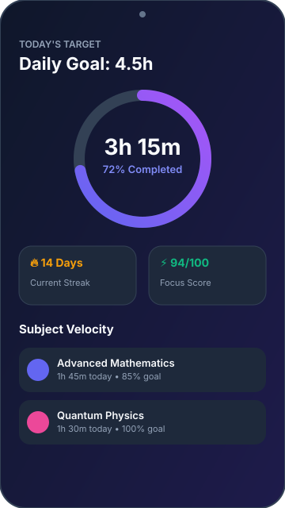
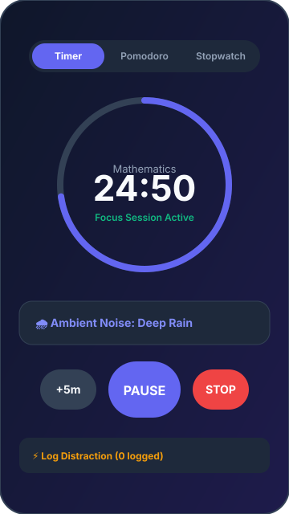
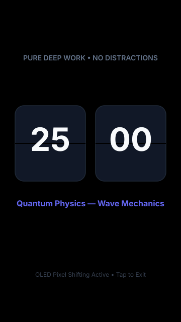
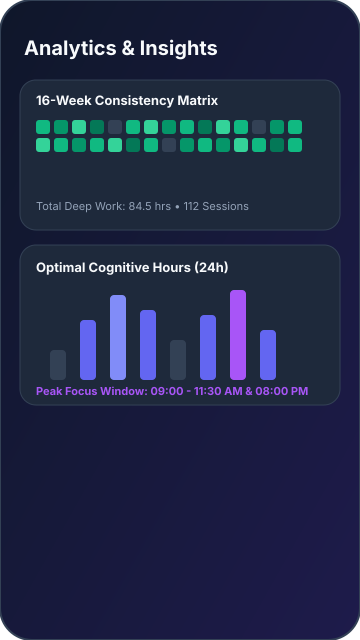
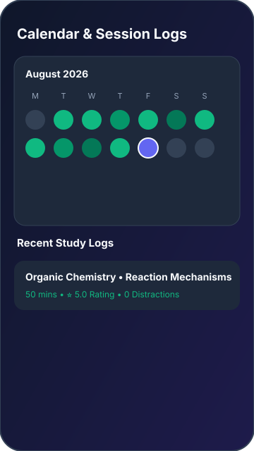
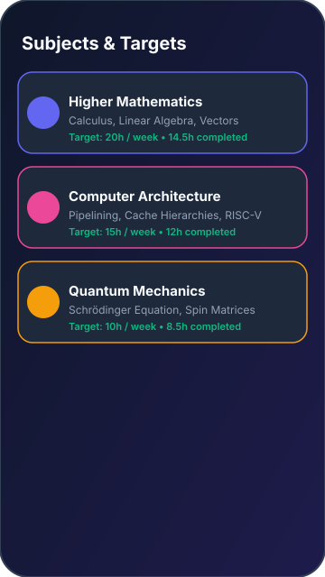

<div align="center">

# ⏱️ Focentra

### *Distraction-Free Offline Study Timer & Deep Work Analytics for Android*

[](https://developer.android.com)
[](https://kotlinlang.org)
[](https://developer.android.com/jetpack/compose)
[](#-privacy--offline-first-guarantee)
[](https://github.com/Niloy-Track-Dev/Focentra/actions)
[](https://github.com/Niloy-Track-Dev/Focentra/releases)
[](LICENSE)

<br/>

**Focentra** is an open-source, privacy-first personal productivity and study timer application crafted for Android. Designed from the ground up for students, researchers, and engineers, Focentra empowers you to build laser-focused study habits with powerful interval timers, ambient soundscapes, multi-period analytics, and visual heatmaps—**without requiring an account, internet connection, or cloud subscription.**

<br/>

[📥 Download APK](#-download-focentra) • [✨ Key Features](#-key-features) • [🏛️ Architecture](#️-project-architecture) • [🛠️ Setup Guide](#-setup-instructions-for-developers) • [🤝 Contributing](#-contributing)

---

</div>

## 📖 Table of Contents
- [💡 Why Focentra?](#-why-focentra)
- [🚀 Key Features](#-key-features)
- [📸 Screenshots & Visual Preview](#-screenshots--visual-preview)
- [📥 Download Focentra](#-download-focentra)
  - [Latest APK Release](#latest-apk-release)
  - [Installation Guide](#installation-guide)
- [🔒 Privacy & Offline-First Guarantee](#-privacy--offline-first-guarantee)
- [🏛️ Project Architecture](#️-project-architecture)
  - [Architecture Flow Diagram](#architecture-flow-diagram)
  - [Layer Breakdown](#layer-breakdown)
- [💻 Tech Stack & Libraries](#-tech-stack--libraries)
- [🗄️ Local Database Model](#️-local-database-model)
- [🔄 Backup, Import & Export](#-backup-import--export)
- [🛠️ Setup Instructions for Developers](#-setup-instructions-for-developers)
  - [Workstation Prerequisites](#workstation-prerequisites)
  - [Cloning and Building](#cloning-and-building)
- [🧪 Testing & Quality Assurance](#-testing--quality-assurance)
- [🤖 GitHub Actions & CI/CD Pipeline](#-github-actions--cicd-pipeline)
- [🗺️ Roadmap](#️-roadmap)
- [📝 Changelog](#-changelog)
- [🐛 Reporting Issues & Feature Requests](#-reporting-issues--feature-requests)
- [🤝 Contributing](#-contributing)
- [📄 License](#-license)
- [👨‍💻 Author & Developer](#-author--developer)
- [📬 Contact & Community](#-contact--community)

---

## 💡 Why Focentra?

Modern productivity apps are often bloated with mandatory sign-ins, intrusive push notifications, aggressive subscription paywalls, and persistent cloud tracking. 

**Focentra takes a fundamentally different approach:**
- **Zero Friction**: Launch the app and start studying immediately. No registration, no email verification, no logins.
- **True Ownership**: All study logs, notes, productivity ratings, and streaks reside 100% locally on your device in an encrypted Room SQLite database.
- **Deep Work Focus**: Flexible study modes (Countdown, Stopwatch, and Pomodoro) combined with built-in ambient white noise and distraction tracking.
- **Actionable Insights**: GitHub-style 16-week heatmap matrices, 24-hour concentration curves, and algorithmic Focus Scores help you uncover your peak study hours.

---

## 🚀 Key Features

| Category | Features Included |
| :--- | :--- |
| ⏱️ **Timer Engine** | • **3 Study Modes**: Countdown timer with presets, open-ended Stopwatch, and structured multi-cycle Pomodoro.<br/>• **Background Service**: Uninterrupted session tracking via Android Foreground Service with interactive notifications.<br/>• **Distraction Logging**: One-tap distraction counter with tags to measure focus friction.<br/>• **Ambient Soundscape**: Built-in sound generator (Rain, Cafe, White Noise, Stream, Forest, Ambient). |
| 📇 **Active Recall Flashcards** | • **3D Perspective Flip**: Interactive 3D flip-card decks (`rotationY`) with question/hint on front and answer on back.<br/>• **Mastery Analytics**: Track mastery progress percentage per subject with one-tap status toggles.<br/>• **Subject Filtering**: Filter decks by subject (Mathematics, Physics, CS, Chemistry, etc.). |
| 🧠 **Focus Brain Dump** | • **Distraction Shield**: Instantly jot down off-topic thoughts or urgent to-dos mid-study without interrupting timer or leaving focus screen.<br/>• **Thought Log**: Time-stamped thought list with checkboxes to review and clear completed items. |
| 🌌 **Immersive Focus** | • **Full-Screen Focus Mode**: Minimalist AMOLED dark canvas with flip-clock aesthetics and quick Brain Dump access.<br/>• **10 Preset UI Themes**: Select custom themes (*OLED Midnight, Cyberpunk Neon, Nordic Aurora, Sunset Amber, Tokyo Night, Emerald Oasis, Matrix Green, Solar Crimson, Deep Cosmos, Zen Slate*) for Timer, Pomodoro, and Stopwatch modes.<br/>• **Anti-Burn-In Protection**: Subtle pixel shifting for OLED displays.<br/>• **Wake-Lock Management**: Keeps the screen awake during active deep work blocks. |
| 📚 **Subjects & Topics** | • **Hierarchical Organization**: Organize sessions by subject and granular sub-topics.<br/>• **Custom Aesthetics**: Associate custom Material symbols and hex color palettes.<br/>• **Target Velocity**: Set target hours per subject and monitor progress rings. |
| 📊 **Analytics & Heatmap** | • **Multi-Period Filtering**: Aggregate data across Today, Yesterday, This Week, Last Week, This Month, Last Month, This Year, and All Time.<br/>• **16-Week Heatmap Grid**: Visual GitHub-style activity grid measuring daily study intensity.<br/>• **Focus Score ($0 - 100$)**: Algorithmic score evaluating productivity ratings, pause ratio, and distraction rates.<br/>• **Shareable PNG Performance Card**: Export high-contrast social cards or formatted text reports in one tap. |
| 🏆 **Habits & Badges** | • **Streak Engine**: Daily active streak counter with longest streak milestones.<br/>• **Unlockable Achievements**: Earn milestone badges (First Step, 10-Hour Club, Night Owl, Weekend Warrior, Consistency Champion). |
| 📅 **History & Calendar** | • **Monthly Heatmap Calendar**: Interactive calendar view detailing study volume per day.<br/>• **Session Inspector**: Searchable session history log with detailed metrics and notes. |
| 🛡️ **Data Portability** | • **Full JSON Backup & Restore**: One-tap backup with clipboard paste integration.<br/>• **CSV Spreadsheet Export**: Export raw data formatted for Microsoft Excel, Google Sheets, and Notion. |
| 🎨 **UI & Customization** | • **Material Design 3**: Dynamic color matching Android 12+ wallpaper palettes.<br/>• **Study Reminders**: Customizable daily reminders with weekday/weekend repeat schedules.<br/>• **Edge-to-Edge Experience**: Modern floating navigation bar with responsive tactile haptics. |

---

## 📸 Screenshots & Visual Preview

<div align="center">

| Dashboard & Goal | Active Focus Timer | Immersive OLED Mode |
| :---: | :---: | :---: |
|  |  |  |

| Multi-Period Analytics | Study Heatmap & History | Subjects & Targets |
| :---: | :---: | :---: |
|  |  |  |

</div>

---

## 📥 Download Focentra

### Latest APK Release
You can obtain the latest pre-compiled Android APK directly from this repository:

| Release Method | Location | Compatibility | Direct Link |
| :--- | :--- | :--- | :--- |
| **Official GitHub Release (v1.2.0)** | GitHub Releases Tab | Android 7.0+ (API 24+) | [**Releases Page**](https://github.com/Niloy-Track-Dev/Focentra/releases) |
| **Automated Build (GitHub Actions)** | GitHub Actions Tab | Android 7.0+ (API 24+) | [**Actions Artifacts**](https://github.com/Niloy-Track-Dev/Focentra/actions) |

### Installation Guide
1. Go to [**GitHub Releases**](https://github.com/Niloy-Track-Dev/Focentra/releases) or the [**GitHub Actions**](https://github.com/Niloy-Track-Dev/Focentra/actions) tab.
2. Download the APK file (`focentra-v1.2.0-release.apk` or `focentra-debug-apk`).
3. Open your device's **Downloads** folder and tap the APK file.
4. If prompted, enable **"Install unknown apps"** in your Android Settings.
5. Tap **Install** and launch **Focentra**.

---

## 🔒 Privacy & Offline-First Guarantee

```text
┌─────────────────────────────────────────────────────────────┐
│                 FOCENTRA PRIVACY CONTRACT                   │
├─────────────────────────────────────────────────────────────┤
│  ✓  NO Account or Login Required                            │
│  ✓  NO Cloud Database Synchronization                       │
│  ✓  NO Analytics SDKs, Ad Networks, or Third-Party Trackers │
│  ✓  NO Background Data Transmissions                        │
│  ✓  100% of your notes, metrics, and timers stay on-device  │
└─────────────────────────────────────────────────────────────┘
```

Your data is stored exclusively inside your device's sandboxed SQLite database via AndroidX Room. You maintain total ownership of your study history and can export it as raw JSON or CSV at any time.

---

## 🏛️ Project Architecture

Focentra is engineered following **Clean Architecture**, **MVVM (Model-View-ViewModel)**, and **Unidirectional Data Flow (UDF)** principles.

### Architecture Flow Diagram

```text
               ┌───────────────────────────────┐
               │    JETPACK COMPOSE UI LAYER   │
               │  (Dashboard, Timer, Focus,    │
               │   Analytics, Calendar, Notes) │
               └───────────────┬───────────────┘
                               │ StateFlow<UiState>
                               │ Events / User Intents
                               ▼
               ┌───────────────────────────────┐
               │        VIEWMODEL LAYER        │
               │   (MainViewModel Coordinator) │
               └───────┬───────────────┬───────┘
                       │               │
       ┌───────────────▼─┐           ┌─▼───────────────┐
       │ DOMAIN ENGINES  │           │   BG SERVICE    │
       │• StatisticsEngine           │• StudyTimerSvc  │
       │• TimerEngine    │           │• WhiteNoisePlay │
       └───────┬─────────┘           └─────────────────┘
               │
               ▼
       ┌───────────────────────────────────────────────┐
       │               STUDY REPOSITORY                │
       └───────┬───────────────────────────────┬───────┘
               │                               │
               ▼                               ▼
       ┌─────────────────┐           ┌─────────────────┐
       │   ROOM SQLITE   │           │    DATASTORE    │
       │(Sessions, Subj) │           │ (Settings, Pref)│
       └─────────────────┘           └─────────────────┘
```

### Layer Breakdown

1. **Presentation Layer (`com.example.ui`)**:
   - 100% declarative UI built with Jetpack Compose and Material 3.
   - Distinct screens for Dashboard, Active Timer, Full-Screen AMOLED Focus, Analytics, Calendar History, Subjects, Achievements, and Settings.
2. **State & Orchestration Layer (`com.example.viewmodel`)**:
   - `MainViewModel` observes asynchronous Kotlin `Flow` streams and exposes immutable `StateFlow` state to Composables.
3. **Domain Engines (`com.example.engine`)**:
   - **`StatisticsEngine`**: High-performance mathematical engine calculating Focus Scores ($0-100$), multi-period aggregations, 16-week GitHub-style heatmap matrices, and 24-hour concentration curves.
   - **`TimerEngine`**: Deterministic state machine governing Countdown, Stopwatch, and Pomodoro phase transitions.
4. **Service & Background Layer (`com.example.service`)**:
   - **`StudyTimerService`**: Android Foreground Service ensuring zero battery-killer termination during active study.
   - **`WhiteNoisePlayer`**: Low-latency ambient audio soundscape engine.
5. **Data & Storage Layer (`com.example.data`)**:
   - **`StudyRepository`**: Orchestrator bridging DAOs, DataStore, and business logic.
   - **`AppDatabase`**: AndroidX Room SQLite database managing relational entities with transactional safety.

> 📖 *For a comprehensive technical deep-dive, consult [`docs/architecture/ARCHITECTURE.md`](docs/architecture/ARCHITECTURE.md).*

---

## 💻 Tech Stack & Libraries

- **Language**: [Kotlin 2.0+](https://kotlinlang.org/) (Coroutines, Flow, Serialization)
- **UI Toolkit**: [Jetpack Compose](https://developer.android.com/jetpack/compose) with [Material Design 3](https://m3.material.io/)
- **Architecture**: MVVM, Clean Architecture, Unidirectional Data Flow
- **Local Database**: [AndroidX Room 2.6+](https://developer.android.com/training/data-storage/room) with SQLite
- **Dependency Processing**: [KSP (Kotlin Symbol Processing)](https://kotlinlang.org/docs/ksp-overview.html)
- **Background Execution**: Android Foreground Service (`StudyTimerService`) & `WakeLock`
- **Preferences**: [AndroidX DataStore Preferences](https://developer.android.com/topic/libraries/architecture/datastore)
- **Serialization**: [Moshi](https://github.com/square/moshi) & `org.json`
- **Unit Testing**: JUnit 4, Robolectric, Kotlinx Coroutines Test, Roborazzi

---

## 🗄️ Local Database Model

```text
Room Database: "focentra_study_db"
├── study_sessions     (Session durations, paused seconds, productivity rating, distractions, notes, mood)
├── subjects           (Custom subjects, color hex values, icon identifiers, target hours)
├── topics             (Sub-topics mapped to parent subjects)
├── timer_presets      (Custom countdown & pomodoro presets)
├── reminders          (Daily study alarm configurations and repeat days)
└── achievements       (Unlocked milestone records and timestamps)
```

---

## 🔄 Backup, Import & Export

Focentra provides full data portability under **Settings > Data & Backup**:

1. **Full JSON Backup**: Generates an immutable snapshot containing all sessions, subjects, topics, and presets. Restorable via direct file import or pasting JSON strings from your clipboard.
2. **Universal CSV Spreadsheet Export**: Formats study history into clean comma-separated values compatible with **Microsoft Excel**, **Google Sheets**, and **Notion**.

---

## 🛠️ Setup Instructions for Developers

### Workstation Prerequisites
- **JDK**: Java Development Kit 17 (Temurin recommended)
- **Android Studio**: Android Studio Ladybug (2024.2.1) or newer
- **Android SDK**: Android API Level 36 (Minimum SDK 24, Target SDK 36)
- **Git**: Version 2.30+

### Cloning and Building

1. **Clone the repository**:
   ```bash
   git clone https://github.com/Niloy-Track-Dev/Focentra.git
   cd Focentra
   ```

2. **Set up environment configuration**:
   ```bash
   cp .env.example .env
   ```

3. **Build the project via Gradle**:
   ```bash
   gradle assembleDebug
   ```

4. **Run Unit Tests**:
   ```bash
   gradle testDebugUnitTest
   ```

---

## 🧪 Testing & Quality Assurance

```bash
# Execute standard JVM unit tests
gradle testDebugUnitTest

# Run tests with stacktrace
gradle testDebugUnitTest --stacktrace
```

Test coverage focuses on:
- **`StatisticsEngineTest`**: Period boundary calculations, focus score formulation, and streak verification.
- **`TimerEngineTest`**: Countdown state machines and pause tracking.
- **`StudyRepositoryTest`**: JSON import deserialization and CSV format generation.

---

## 🤖 GitHub Actions & CI/CD Pipeline

The repository is equipped with automated CI/CD workflows:

- **`.github/workflows/android-ci.yml`**: Automatically triggers on pushes and pull requests to `main` and `develop`. Validates compilation and executes unit tests.
- **`.github/workflows/build-release-apk.yml`**: Automatically builds, signs, and packages the release APK, and attaches it directly to GitHub Releases.

---

## 🗺️ Roadmap

- [x] **v1.0.0 - Core Launch**: Countdown, Stopwatch, and Pomodoro timer modes.
- [x] **v1.0.0 - Advanced Analytics**: 16-week study heatmap, Focus Score, and hourly breakdown.
- [x] **v1.0.0 - Soundscapes & OLED Mode**: Ambient audio player and full-screen flip clock.
- [x] **v1.0.0 - Data Portability**: Full JSON backup/restore and CSV spreadsheet exporter.
- [x] **v1.2.1 - Active Recall Flashcards**: 3D interactive flip cards with mastery progress tracking.
- [x] **v1.2.1 - Focus Brain Dump**: Instant distraction shield & thought pad mid-study.
- [x] **v1.2.1 - Performance Card Exporter**: One-tap shareable PNG performance card generation.
- [x] **v1.2.0 - Full-Screen Theme Presets**: 10 customizable themes (*OLED Midnight*, *Cyberpunk Neon*, *Nordic Aurora*, *Sunset Amber*, *Tokyo Night*, *Emerald Oasis*, *Matrix Green*, *Solar Crimson*, *Deep Cosmos*, *Zen Slate*) with live preview for Timer, Pomodoro & Stopwatch modes.
- [ ] **v1.3.0 - Glance AppWidget**: Home-screen study widget for one-tap timer launches.
- [ ] **v2.0.0 - Wear OS Module**: Standalone Wear OS companion app.

> 🗺️ *See [`ROADMAP.md`](ROADMAP.md) for upcoming milestones and ideas.*

---

## 📝 Changelog

Detailed release notes and historical changes are maintained in [`CHANGELOG.md`](CHANGELOG.md).

---

## 🐛 Reporting Issues & Feature Requests

- **Bug Reports**: Open an issue using our [Bug Report Template](.github/ISSUE_TEMPLATE/bug_report.md).
- **Feature Requests**: Propose ideas using our [Feature Request Template](.github/ISSUE_TEMPLATE/feature_request.md).
- **Security Inquiries**: Please review our [Security Policy](SECURITY.md) for responsible private disclosure.

---

## 🤝 Contributing

Contributions of all kinds are welcome!

1. Read our [Code of Conduct](CODE_OF_CONDUCT.md).
2. Check out the [Contributing Guide](CONTRIBUTING.md) for branch naming conventions and coding standards.
3. Submit a Pull Request using our [PR Template](.github/pull_request_template.md).

---

## 📄 License

Focentra is released as open-source software under the permissive **[MIT License](LICENSE)**.

---

## 👨‍💻 Author & Developer

**Niloy Mitra**  
Student Developer & Aspiring Software Engineer  
GitHub: [@Niloy-Track-Dev](https://github.com/Niloy-Track-Dev) • Email: `niloymitra889@gmail.com`

---

## 📬 Contact & Community

- **Project Repository**: [https://github.com/Niloy-Track-Dev/Focentra](https://github.com/Niloy-Track-Dev/Focentra)
- **Bug Reports & Issues**: [GitHub Issues](https://github.com/Niloy-Track-Dev/Focentra/issues)
- **Community Discussions**: [GitHub Discussions](https://github.com/Niloy-Track-Dev/Focentra/discussions)
- **Developer Email**: `niloymitra889@gmail.com`

---

<div align="center">

*Built with ❤️ and Kotlin for focused learners worldwide.*

**[⬆ Back to Top](#-table-of-contents)**

</div>
